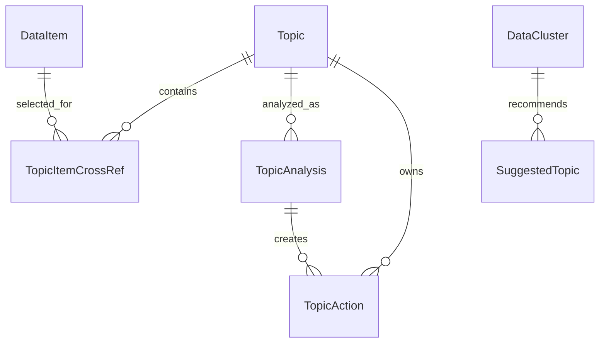
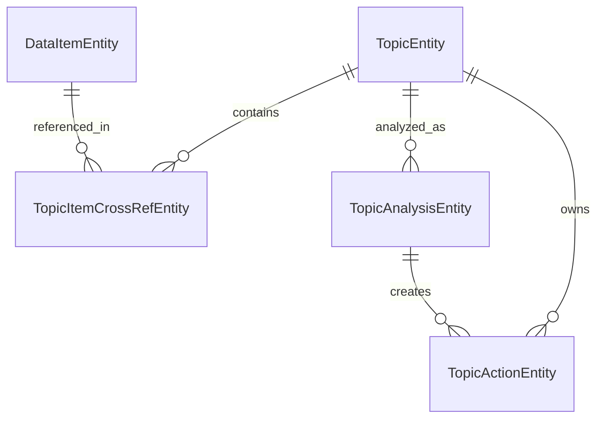

# SmartClipboardAI

흩어진 정보를 모아, 다음 작업으로 이어주는 Android 앱.

복사한 텍스트, 링크, 스크린샷, 사진을 하나의 데이터 흐름으로 정리하고, AI Agent가 작업 주제에 맞는 실행 초안을 만들어줍니다. 단순히 저장하는 것이 아니라, 모은 정보에서 사용자의 다음 행동을 도출하는 것이 목표입니다.

## 핵심 철학

- **사용자 검토 원칙** — AI가 초안을 만들 수 있지만, 최종 실행은 항상 사용자가 검토한 뒤 명시적으로 수행합니다.
- **명시적 수집** — 백그라운드에서 몰래 클립보드나 화면을 감시하지 않습니다. 모든 데이터 수집은 사용자의 명시적 액션에서 시작합니다.
- **초안 중심** — AI의 출력은 바로 실행되는 명령이 아니라 사용자가 검토하고 수정할 수 있는 초안입니다.

### 금지 구현

- 백그라운드 클립보드 지속 감시
- 화면 내용 자동 감시
- 접근성 API를 통한 무단 수집
- 다른 앱의 공유 흐름 자동 가로채기
- 사용자 검토 없이 AI가 외부 앱에 일정, 노트, 리마인더를 바로 생성하는 흐름
- 클립보드 히스토리 전체를 Android 공개 API로 읽으려는 구현

---

## 앱 흐름도

SmartClipboardAI는 두 가지 핵심 Flow로 동작합니다.

### Flow A — 사용자가 주제를 입력하면 Agent가 작업 초안을 만드는 흐름

```
주제 입력 → 검색 계획 수립 → 로컬 DB 검색 → 아이템 추천
→ 사용자 아이템 선택 → 작업 초안 생성 → 사용자 검토/수정 → Tool 실행
```

세부 단계:

1. 사용자가 작업 주제를 입력합니다.
2. **TopicPlanner**가 주제를 분석해 검색 키워드, 타입 필터, 날짜 범위 등 검색 계획을 수립합니다.
3. **DataRetriever**가 로컬 DB에서 조건에 맞는 DataItem을 검색합니다.
4. **ItemRecommendationAgent**가 검색 결과를 관련도 순으로 정렬하고 추천 아이템을 선별합니다.
5. 사용자가 AI 추천 아이템을 확인하고, 직접 추가/제거할 수 있습니다.
6. **TaskAgent**가 선택된 아이템을 바탕으로 주제 분석과 작업 초안을 생성합니다.
7. 사용자가 초안을 검토하고 수정합니다.
8. **ToolRouter**가 작업 타입에 맞는 Tool을 매핑하고, 사용자가 최종 확인하면 실행합니다.
9. 피드백을 주면 **RefineAgent**가 초안을 보완할 수 있습니다.

### Flow B — AI가 데이터를 분석해 주제를 추천하는 흐름

```
Purpose 분석 → 클러스터링 → 주제 추천 → 사용자 선택 → Flow A로 이어짐
```

세부 단계:

1. **PurposeAgent**가 각 DataItem의 수집 목적을 추론합니다.
2. **Clusterer**가 purpose 기반으로 의미적으로 묶습니다.
3. **ClusterTopicAgent**가 각 클러스터에 대해 추천 주제를 생성합니다.
4. 사용자가 추천 주제를 선택하면 Flow A의 Agent 세션으로 이어집니다.

---

## 사용자 맞춤형 에이전트 구현

### 개발 의도

SmartClipboardAI의 에이전트는 "범용 AI 비서"가 아닙니다. 사용자가 **직접 수집한 데이터**를 기반으로, 그 사용자의 **구체적인 작업 맥락**에 맞춘 초안을 생성하는 데 특화되어 있습니다.

이 설계는 다음 문제의식에서 출발합니다.

- **수집한 데이터는 맥락을 잃기 쉽다** — 복사한 텍스트, 스크린샷, 링크는 시간이 지나면 왜 모았는지, 무엇에 쓰려 했는지 알 수 없게 됩니다.
- **AI가 문맥을 이해하려면 사용자 관점이 필요하다** — 데이터 자체의 내용뿐 아니라, "이 사용자가 왜 이 정보를 찾았는지"를 파악해야 의미 있는 작업 초안을 만들 수 있습니다.
- **사용자마다 수집 패턴이 다르다** — 같은 링크라도 어떤 사용자는 회의 준비용으로, 다른 사용자는 개인 학습용으로 수집합니다. 범용 분류가 아닌 사용자 맥락 기반 분석이 필요합니다.

### Purpose — 맞춤 분석의 핵심 메커니즘

이 문제를 해결하기 위해 SmartClipboardAI는 **Purpose 분석**을 핵심 메커니즘으로 삼습니다.

모든 DataItem은 저장 시 **"이 정보를 찾은 사람이 왜 찾았을까"**를 추론받습니다. 이 결과는 두 가지 형태로 저장됩니다.

| 필드 | 형태 | 예시 |
|---|---|---|
| `purpose` | 문장 | "회의 준비를 위해 관련 자료를 조사함" |
| `purposeKeyword` | 콤마 구분 키워드 | "회의,준비,자료,조사" |

Purpose 정보는 이후 모든 에이전트 단계에서 활용됩니다.

- **클러스터링** — purposeKeyword 기반으로 의미적으로 묶음
- **데이터 검색** — 사용자 주제와 purpose의 유사도로 관련 아이템 판별
- **작업 초안 생성** — purpose를 참고하여 사용자 의도에 맞는 Action 도출

### 에이전트 체계

각 에이전트는 단일 책임을 가지며, 입력과 출력이 명확히 정의된 계약 기반으로 동작합니다.

| 에이전트 | 역할 | 입력 | 출력 |
|---|---|---|---|
| **PurposeAgent** | 각 DataItem의 수집 목적 추론 | DataItem 목록 | purpose + purposeKeyword |
| **TopicPlanner** | 주제 기반 검색 계획 수립 | 주제 문자열 | 검색 키워드, 타입 필터, 날짜 범위 |
| **FindData** | 주제와 관련된 데이터 검색 | 주제 + DataItem 목록 | 관련 DataItem ID 집합 |
| **ItemRecommendationAgent** | 후보 아이템 정렬/추천/선택 | 주제 + 검색 계획 + 후보 아이템 | 정렬된 추천 아이템 + 선택 ID + 추천 이유 |
| **TaskAgent** | 주제 분석 + 작업 초안 생성 | Topic + DataItem 목록 + 사용자 지시 | 요약 + 핵심 포인트 + 작업 초안 목록 |
| **RefineAgent** | 피드백 기반 작업 초안 보완 | 주제 + 현재 초안 + 피드백 | 보완된 작업 초안 목록 |
| **Clusterer** | purpose 기반 클러스터링 | DataItem 목록 | 클러스터 목록 |
| **ClusterTopicAgent** | 클러스터별 추천 주제 생성 | 클러스터 목록 + DataItem 목록 | 추천 주제가 포함된 클러스터 목록 |

### Agent 세션 상태 머신

Flow A의 전체 생명주기는 상태 머신으로 관리됩니다. 사용자는 각 단계에서 확인과 수정을 수행합니다.

```
Idle → PlanningRetrieval → RetrievingItems → AwaitingItemSelection
    → GeneratingActions → AwaitingActionSelection → RoutingTool
    → AwaitingExecutionConfirm → Executing → Observing → Completed

예외 경로:
  AwaitingActionSelection → Refining → GeneratingActions  (피드백 기반 재생성)
  임의 상태 → Failed  (오류, recoverable 여부에 따라 재시도 가능)
```

| 상태 | 의미 |
|---|---|
| **Idle** | 주제 입력 대기 |
| **PlanningRetrieval** | 검색 계획 수립 중 |
| **RetrievingItems** | 로컬 DB 검색 중 |
| **AwaitingItemSelection** | 후보 아이템 표시, 사용자 선택 대기 |
| **GeneratingActions** | 작업 초안 생성 중 |
| **AwaitingActionSelection** | 작업 초안 표시, 사용자 선택 대기 |
| **RoutingTool** | 선택된 작업에 맞는 Tool 매핑 |
| **AwaitingExecutionConfirm** | 실행 전 payload 확인, 사용자 승인 대기 |
| **Executing** | Tool 실행 중 |
| **Observing** | 실행 결과 확인 |
| **Refining** | 피드백 기반 재생성 |
| **Completed** | 완료 |
| **Failed** | 오류 발생 (복구 가능 여부 포함) |

---

## 아키텍처

MVVM 기반 구조를 따릅니다.

```
domain/       핵심 모델, repository/retrieval/tool 인터페이스
data/         Room entity, DAO, repository 구현, Android data source, retrieval/tool 구현
gemini/       Gemini API 연동 에이전트
presentation/ Activity, ViewModel, Compose 화면
database/     Room database, DAO, entity
di/           Hilt module, dispatcher 주입
```

### 모델 관계



---

## 핵심 모델

### DataItem — 모든 수집 데이터의 기본 단위

텍스트, 링크, 이미지, 파일, 스크린샷을 통합적으로 표현합니다.

| 필드 | 타입 | 설명 |
|---|---|---|
| `id` | Long | 고유 식별자 |
| `type` | DataItemType | TEXT, LINK, IMAGE, FILE, SCREENSHOT |
| `content` | String | 원본 콘텐츠 (텍스트 본문, URI 등) |
| `title` | String? | 제목 |
| `source` | String? | 출처 (앱명, URL 도메인 등) |
| `mimeType` | String? | MIME 타입 |
| `createdAt` | Long | 수집 시각 |
| `extractedContent` | String? | 이미지/파일에서 추출한 텍스트 (OCR, URL 본문 등) |
| `purpose` | String? | 수집 목적 추론 결과 (문장 형태) |
| `purposeKeyword` | String? | purpose의 키워드 추출 (콤마 구분), 클러스터링/검색에 사용 |

`effectiveContent` 프로퍼티: type이 TEXT면 content를, 아니면 extractedContent를 반환합니다. 이미지에서 OCR로 추출한 텍스트나 URL에서 스크랩한 본문에 쉽게 접근하기 위한 편의 프로퍼티입니다.

### DataCluster & SuggestedTopic — 클러스터링 결과와 추천 주제

| 모델 | 주요 필드 | 설명 |
|---|---|---|
| **DataCluster** | clusterId, clusterLabel, itemIds, topicCandidates | 클러스터링 결과. 포함된 DataItem ID 목록과 추천 주제 보유 |
| **SuggestedTopic** | suggestedTitle, description, confidence, reason, relatedClusterId | 클러스터에서 파생된 추천 주제. 영구 DB 모델이 아닌 임시 UI 상태이며, 사용자가 선택하면 Topic으로 변환됨 |

### Topic & TopicAnalysis — 작업 주제와 분석 결과

| 모델 | 주요 필드 | 설명 |
|---|---|---|
| **Topic** | id, title, itemCount, createdAt, updatedAt | 사용자가 최종 확정한 작업 주제 |
| **TopicAnalysis** | id, topicId, summary, keyPoints, sourceItemIds, createdAt | Agent가 주제와 자료를 분석한 중간 결과. 요약, 핵심 포인트, 원본 데이터 ID 포함 |

### AgentResult & AgentActionDraft — Agent의 출력

TaskAgent의 분석 결과는 TopicAnalysis 1개 + AgentActionDraft N개로 분해되어 DB에 저장됩니다.

| 모델 | 주요 필드 | 설명 |
|---|---|---|
| **AgentResult** | topicId, summary, keyPoints, sourceItemIds, actions | TaskAgent의 최종 출력 |
| **AgentActionDraft** | type, confidence, reason, title, body, payload, sourceItemIds | 개별 작업 초안. type은 SUMMARY/CALENDAR/REMINDER/SHARE_DRAFT/TODO 중 하나 |

### TaskSelection — DB에 영구 저장되는 작업 초안

AgentActionDraft가 사용자 검토를 거쳐 DB에 저장된 형태입니다.

| 상태 | 의미 |
|---|---|
| **DRAFT** | AI가 생성한 초기 상태 |
| **EDITED** | 사용자가 수정한 상태 |
| **EXECUTED** | 사용자가 실행한 상태 |
| **DISMISSED** | 사용자가 사용하지 않은 상태 |

### CandidateItem & RetrievalPlan — 검색/추천 보조 모델

| 모델 | 설명 |
|---|---|
| **CandidateItem** | DataItem + 관련성 점수 + 관련성 설명. 검색/추천 결과의 래퍼 |
| **RetrievalPlan** | 검색 키워드, 타입 필터, 날짜 범위, 최대 결과 수. TopicPlanner가 생성하는 검색 계획 |

---

## Tool 시스템

AI Agent의 작업 초안을 실제 Android 동작으로 연결하는 시스템입니다.

### 구조

| 컴포넌트 | 역할 |
|---|---|
| **ToolRegistry** | 등록된 ToolSpec 목록 관리. LLM이 새 toolName을 임의로 만들어도 사용할 수 없음 |
| **ToolRouter** | AgentActionDraft.type을 toolName으로 매핑 |
| **ToolExecutor** | ToolSpec에 따라 실제 Android 동작 실행 |

### ToolSpec

각 Tool은 이름, 설명, 위험도(LOW/MEDIUM/HIGH), 실행 전 사용자 확인 필요 여부, Android Intent action, 필수 입력 필드를 정의합니다.

### 등록된 Tool

| Tool | 설명 | 위험도 | 확인 필요 |
|---|---|---|---|
| `copy_to_clipboard` | 텍스트를 클립보드에 복사 | LOW | 아니오 |
| `share_text` | Android 공유 시트로 텍스트 공유 | LOW | 예 |
| `open_url` | 브라우저에서 URL 열기 | LOW | 예 |
| `compose_email` | 이메일 앱에서 초안 작성 | MEDIUM | 예 |
| `save_note` | 앱 내부 노트로 저장 | LOW | 아니오 |
| `insert_calendar_event` | 캘린더 앱에 일정 초안 생성 | MEDIUM | 예 |
| `save_note_share` | 공유 시트로 노트 앱에 전달 (삼성 노트 등) | LOW | 예 |
| `set_reminder` | 리마인더/알람 앱에 알림 초안 생성 | MEDIUM | 예 |

---

## 클러스터링

저장된 데이터는 purpose 기반으로 클러스터링됩니다. **Gemini 우선, 실패 시 로컬 폴백** 구조입니다.

### GeminiClusterer

- purpose/purposeKeyword가 있는 아이템을 대상으로 Gemini API 호출
- 최대 50개 아이템 처리, 초과분은 LocalClusterer에 위임
- 응답 파싱 실패 또는 크기 불일치 시 LocalClusterer로 자동 폴백

### LocalClusterer (폴백)

- Jaccard 유사도 + Union-Find 기반 로컬 클러스터링
- 최대 300개 아이템, O(N²) 유사도 계산
- purposeKeyword 토큰에 높은 가중치 반영, type/source 일치 시 부스트
- 최대 10개 클러스터 생성

---

## 데이터 수집 흐름

### Share — 링크/텍스트/이미지/파일

1. 사용자가 다른 앱에서 공유 → **ShareReceiverActivity** 실행
2. **AndroidShareContentHandler**가 콘텐츠 타입별로 파싱
3. DataRepository가 DataItem으로 저장 + Purpose 분석 수행
4. 저장 피드백 UI 표시 후 종료

### Quick Settings Tile — 클립보드

1. 사용자가 텍스트/링크 복사 후 Tile 탭
2. **ClipboardCaptureTileService** → **ClipboardCaptureActivity** 실행
3. 포커스 획득 후 Primary Clip 읽기
4. **DefaultClipboardCaptureHandler**가 DataItem으로 저장
5. 저장 피드백 후 종료

### MediaStore — 스크린샷/이미지

1. 앱 실행 시 Last Sync Time 이후 MediaStore 후보 탐지
2. 새 이미지/스크린샷 후보를 검토 화면에 표시
3. 사용자가 필요한 항목만 선택해 저장
4. 저장 시 OCR 추출 + Purpose 분석 수행

---

## DB 스키마

### Entity 관계



### Entity 개요

| Entity | 테이블 | 주요 필드 | 설명 |
|---|---|---|---|
| **DataItemEntity** | `data_items` | type, content, title, source, mimeType, extractedContent, purpose, purposeKeyword | 모든 수집 데이터. purpose/purposeKeyword는 PurposeAgent 결과 |
| **TopicEntity** | `topics` | title, createdAt, updatedAt | 작업 주제. title+createdAt 유니크 인덱스 |
| **TopicAnalysisEntity** | `topic_analysis_results` | topicId(FK), summary, keyPoints, sourceItemIds | 주제 분석 결과. TopicEntity에 CASCADE 삭제 |
| **TopicActionEntity** | `topic_actions` | topicId(FK), analysisResultId(FK), type, title, body, status, editablePayload | 작업 초안. TopicEntity에 CASCADE, TopicAnalysisEntity에 SET_NULL |
| **TopicItemCrossRefEntity** | `topic_item_cross_refs` | topicId(PK), itemId(PK), addedAt, addedBy | Topic-DataItem 다대다 관계. addedBy는 "USER" 또는 "AI" |
| **KnowledgeEntity** | `knowledge_table` | type(InputType), source, title, topic, purpose, summary, keywords, groupKey, groupReason | 지식 베이스. InputType은 OCR/URL/TEXT |

---

## 기술 스택

| 분류 | 기술 |
|---|---|
| 언어 | Kotlin |
| UI | Jetpack Compose, Material 3, Navigation Compose |
| 아키텍처 | MVVM, Hilt (DI) |
| DB | Room |
| 비동기 | Coroutines, Flow |
| 이미지 로딩 | Coil |
| AI/LLM | Gemini 3.1 Flash Lite (OkHttp REST 호출) |
| 직렬화 | kotlinx-serialization-json |
| 웹 추출 | Jsoup, readability4j |
| OCR | Google ML Kit (한국어 텍스트 인식) |
| 텍스트 분류 | Google MediaPipe Text |
| 네트워크 | OkHttp |
| 설정 저장 | DataStore Preferences |
| 빌드 | Gradle Version Catalog, KSP |

---

## 프로젝트 구조

```
app/src/main/java/com/samsung/smartclipboard/
├── SmartClipboardApp.kt
├── domain/
│   ├── model/          # DataItem, Topic, AgentSession, AgentResult, CandidateItem, ...
│   ├── repository/     # DataRepository, KnowledgeRepository (interface)
│   ├── retrieval/      # DataClusterer, DataRetriever, CandidateItemRanker (interface)
│   └── tool/           # ToolExecutor, ToolRegistry, ToolRouter (interface)
├── data/
│   ├── ai/             # DefaultSourceExtractor
│   ├── repository/     # DataRepositoryImpl, KnowledgeRepositoryImpl
│   ├── retrieval/      # LocalClusterer, LocalDataRetriever, LocalCandidateItemRanker
│   ├── source/
│   │   ├── clipboard/  # AndroidClipboardDataSource, ClipboardCaptureHandler
│   │   ├── share/      # AndroidShareContentHandler, ShareReceiverActivity
│   │   ├── screenshot/ # ScreenshotImportHandler
│   │   └── local/      # KeywordConverters
│   └── tool/           # ToolExecutorImpl, ToolRegistryImpl, ToolRouterImpl
├── database/
│   ├── SmartClipboardDatabase.kt
│   ├── dao/            # DataItemDao, TopicDao, KnowledgeDao
│   └── entity/         # DataItemEntity, TopicEntity, TopicAnalysisEntity, ...
├── gemini/
│   ├── GeminiManager.kt
│   ├── GeminiPurposeAgent.kt
│   ├── GeminiTopicPlanner.kt
│   ├── GeminiFindData.kt
│   ├── GeminiItemRecommendationAgent.kt
│   ├── GeminiTaskAgent.kt
│   ├── GeminiRefineAgent.kt
│   ├── GeminiClusterer.kt
│   ├── GeminiClusterTopicAgent.kt
│   └── GeminiUtils.kt
├── presentation/
│   ├── main/
│   │   ├── home/       # HomeScreen, HomeViewModel
│   │   ├── data/       # DataScreen, TopicDataSelectionScreen
│   │   ├── aitopicselection/  # AiTopicSelectionScreen, AnalyzingScreen
│   │   ├── manualdataselection/ # ManualDataSelectionScreen
│   │   ├── taskselection/  # TaskSelectionScreen
│   │   ├── taskreview/     # TaskReviewScreen
│   │   ├── history/        # HistoryScreen
│   │   ├── storage/        # StorageViewModel
│   │   └── permission/     # PermissionScreen, OnboardingDateScreen
│   ├── clipboard/      # ClipboardCaptureActivity, Screen, ViewModel
│   ├── share/          # ShareReceiverActivity, Screen, ViewModel
│   └── tile/           # ClipboardCaptureTileService
└── di/                 # AppModule, AiModule, AgentModule, ClipboardModule, ShareModule, CoroutineModule
```

---

## 참고 문서

- [프로젝트 명세](docs/PROJECT_SPEC.md)
- [아키텍처](docs/ARCHITECTURE.md)
- [UX 흐름](docs/UX_FLOW.md)
- [데이터 수집 전략](docs/DATA_COLLECTION_STRATEGY.md)
- [구현 계획](docs/IMPLEMENTATION_PLAN.md)
- [브랜치 규칙](docs/BRANCH_RULES.md)