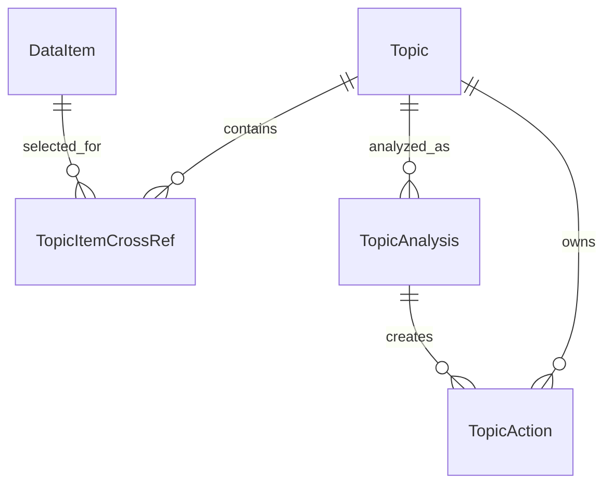

# SmartClipboardAI 아키텍처

## 기준 구조

SmartClipboardAI는 Kotlin + Jetpack Compose 기반 Android 앱입니다. 현재 코드는 MVVM에 가까운 구조로 나뉘어 있습니다.

- `domain`: 앱의 핵심 모델과 repository interface
- `data`: Room entity, DAO, repository 구현, Android data source
- `presentation`: Activity, ViewModel, Compose 화면
- `di`: Hilt module과 dispatcher 주입
- `ui/theme`: One UI inspired theme

## MVVM 기반 역할

- Activity는 Android lifecycle, permission launcher, intent 진입점을 담당합니다.
- ViewModel은 UI 상태와 사용자 intent를 처리합니다.
- Repository는 데이터 저장/조회와 주요 use case의 중심 facade 역할을 합니다.
- DataSource/Handler는 Android API와 직접 맞닿은 기능을 담당합니다.
- Compose 화면은 상태를 렌더링하고 event를 ViewModel intent로 전달합니다.

## DataRepository 중심 데이터 흐름

현재 `DataRepository`는 모든 데이터 흐름의 중심입니다.

주요 역할:

- `DataItem` 관찰 및 추가
- Share/Tile/MediaStore로 들어온 데이터 저장
- Topic 생성 및 DataItem 연결
- TopicAnalysis 생성
- TopicAction 초안 생성
- AiProposal 관찰 및 생성

현재 `DataRepositoryImpl`은 너무 많은 책임을 가지고 있으므로, 이후 작업에서는 기능별 collaborator로 분리하는 방향이 좋습니다. 단, 기존 구현을 바로 버리지 않고 안정적인 facade로 유지하면서 내부를 점진적으로 정리합니다.

## 모델 관계

### DataItem / DataItemEntity

모든 수집 데이터의 기본 단위입니다. MVP에서는 cluster 정보를 `DataItem`과 `DataItemEntity` 필드로 추가합니다.

### Topic

사용자가 확정한 작업 주제입니다. AI 추천은 보조일 뿐 최종 Topic 생성은 사용자 승인 후 일어납니다.

### TopicAnalysis

Topic과 연결된 자료를 분석한 결과입니다.

### TopicAction

실행 명령이 아니라 사용자가 검토할 수 있는 초안입니다.

## 기술별 역할 분리

### Room

- `DataItemEntity`, `TopicEntity`, `TopicAnalysisEntity`, `TopicActionEntity` 저장
- migration은 공통 기반 작업으로 순차 처리
- DB schema 변경은 사전 승인 필요

### Hilt

- Repository, Handler, DataSource, CoroutineDispatcher 주입
- 새 Manager/Processor 추가 시 module 변경 충돌에 주의

### Coroutines

- Room, MediaStore, 파일 복사, OG tag 추출, Gemini 호출은 IO dispatcher에서 실행
- UI 상태 업데이트는 ViewModel scope에서 처리

### Compose

- 화면은 가능한 작은 단위 composable로 분리
- 현재 `MainScreen.kt`는 크기가 커서 UX 재설계 task에서 단계적으로 분리

## Android 컴포넌트 역할

### MainActivity

앱의 메인 진입점입니다. 현재 Media 권한 요청, 초기 screenshot import trigger, handoff launcher 연결을 담당합니다.

### ShareReceiverActivity

Android Share Sheet에서 선택되었을 때 실행됩니다. 링크/텍스트/이미지/파일을 받아 저장 피드백을 보여줍니다.

### ClipboardCaptureTileService

Quick Settings Tile entry입니다. Tile 자체에서 클립보드를 읽지 않고 `ClipboardCaptureActivity`를 엽니다.

### ClipboardCaptureActivity

투명 Activity 역할을 합니다. 포커스를 얻은 뒤 가장 최근 Primary Clip을 읽어 저장합니다.

### TransparentActivity

현재 별도 이름의 `TransparentActivity` 클래스는 없고, `ShareReceiverActivity`와 `ClipboardCaptureActivity`가 투명 theme을 사용해 해당 역할을 수행합니다.

## 현재 재사용 가능한 코드

- `DataRepository` / `DataRepositoryImpl`: 중앙 흐름 facade로 재사용
- `AndroidShareContentHandler`: Share Target 처리 기반으로 재사용
- `DefaultClipboardCaptureHandler`: Tile 기반 clipboard 저장 기반으로 재사용
- `AndroidMediaStoreDataSource`: MediaStore query 기반으로 재사용
- `DefaultMediaImportHandler`: 중복 방지와 screenshot 판별 일부 재사용
- `Topic` / `TopicAnalysis` / `TopicAction` 모델: README와 맞으므로 유지
- `HandoffDraftFormatter` / `HandoffLauncher`: 공유 초안과 Calendar draft 초기 기반으로 재사용
- `SmartClipboardTheme`: One UI inspired 팔레트 유지

## T-000 코드 감사 결과 (2026-05-26)

### 확인 범위

- `README.md`
- `app/src/main/java/com/samsung/smartclipboard`
- `app/src/main/AndroidManifest.xml`
- `app/build.gradle.kts`
- `docs/`

### 유지할 기반

| 영역 | 현재 파일 | 판단 |
| --- | --- | --- |
| 앱 구조 | `domain`, `data`, `presentation`, `di`, `ui/theme` | MVVM 기준의 기본 층 분리는 유지합니다. |
| 저장 모델 | `DataItem`, `Topic`, `TopicAnalysis`, `TopicAction` 및 대응 Entity/DAO | README의 핵심 결과물과 맞으므로 유지합니다. 단 `DataItem` cluster 필드는 T-140에서 추가합니다. |
| Share Target | `ShareReceiverActivity`, `AndroidShareContentHandler` | Android 정책상 가능한 수집 흐름이므로 유지하고 실패 처리와 피드백 UX를 개선합니다. |
| Quick Tile clipboard | `ClipboardCaptureTileService`, `ClipboardCaptureActivity`, `DefaultClipboardCaptureHandler` | Tile이 직접 읽지 않고 Activity를 여는 방향이 문서1/문서2와 맞으므로 유지합니다. |
| MediaStore 기반 | `AndroidMediaStoreDataSource`, `DefaultMediaImportHandler` | MediaStore query와 screenshot 판별 기반은 재사용합니다. 자동 저장은 검토 후 저장 흐름으로 바꿔야 합니다. |
| Topic/Action 초안 | `DataRepositoryImpl.runTopicAnalysis`, `TopicActionEntity`, `HandoffDraftFormatter`, `HandoffLauncher` | MVP 1순위인 Topic/Agent 초안 경험의 초기 골격으로 참고합니다. Gemini 연동 전까지 mock/heuristic 역할로 제한합니다. |
| DI/Coroutine | `AppModule`, `AiModule`, `ClipboardModule`, `MediaModule`, `CoroutineModule` | Hilt와 IO dispatcher 주입 구조는 유지합니다. 새 manager 추가 시 공통 모듈 충돌을 주의합니다. |

### 수정할 기반

| 영역 | 현재 상태 | 필요한 방향 |
| --- | --- | --- |
| `DataRepositoryImpl` | 저장, Topic, 분석, action, proposal 생성 책임이 한 클래스에 모여 있습니다. | facade는 유지하되 내부 collaborator를 기능별로 분리합니다. |
| `MainScreen.kt` | 약 1888줄의 대형 Compose 파일입니다. | UX 재설계 task에서 화면 단위 composable과 상태 흐름을 분리합니다. |
| `AiProposal` | `AiProposalEntity`, `AiProposalDao`, `observeProposals()`로 영구 저장됩니다. | 사용자 결정에 따라 임시 추천 UI 상태로 축소하거나 Topic 후보 상태로 재정의합니다. |
| MediaStore import | 최근 100개 중 screenshot 후보를 바로 `DataItem`으로 저장합니다. | Last Sync Time 이후 후보를 보여주고 사용자가 검토 후 저장하게 바꿉니다. |
| TopicAnalysis/Action 생성 | 현재는 heuristic 문자열 조립입니다. | Gemini 계약을 정의하고, 결과는 사용자가 검토 가능한 초안으로만 저장합니다. |
| 테스트 | 기본 ExampleUnitTest/InstrumentedTest 수준입니다. | QA phase에서 Share/Tile/MediaStore/Topic/Agent 수동 및 자동 검증을 확장합니다. |

### 새로 정의해야 할 계약

| 이름 | 현재 상태 | 다음 작업 |
| --- | --- | --- |
| `WebExtractor` | 실제 클래스 없음. Jsoup dependency도 아직 없음. | T-150에서 OG tag 추출 계약과 IO dispatcher 실행 기준을 정의합니다. |
| `OCRProcessor` | 실제 클래스 없음. | T-160에서 로컬 OCR 알고리즘을 interface 뒤에 연결합니다. |
| `GeminiManager` | 실제 클래스 없음. | T-400/T-410 이전에 Gemini 호출 계약, mock, 실패 처리를 정합니다. |
| `ClusterManager` 계열 | 실제 클래스 없음. | T-170에서 `DataItem` cluster 필드 갱신 책임을 정의합니다. |
| SAF picker | 현재 구현 클래스 없음. | T-130에서 Storage Access Framework picker 흐름을 추가합니다. |

### 제거 또는 축소 후보

- `AiProposalEntity`, `AiProposalDao`, `SmartClipboardDatabase`의 `ai_proposals` table은 MVP 결정과 충돌합니다. 바로 삭제하지 말고 T-030/T-200에서 임시 UI 상태로 전환할지, migration으로 제거할지 결정합니다.
- `HeuristicAiProposalGenerator`는 Gemini 도입 전 prototype/mock으로만 유지합니다. 최종 Agent 품질 판단 기준으로 사용하지 않습니다.
- 현재 MediaStore 자동 import UX는 “새로 발견한 항목 검토 후 저장” 원칙과 다릅니다. 데이터 소스는 살리고 저장 타이밍만 바꿉니다.
- `MainScreen.kt`의 기존 화면 구성은 참고 자료로 보되, 새 UX의 화면 단위와 navigation 기준을 먼저 세운 뒤 점진적으로 교체합니다.

## 아직 없는 클래스와 재사용 가능성

검색 결과 현재 코드에는 아래 클래스 계열이 실제 구현되어 있지 않습니다.

- `OCRProcessor`
- `WebExtractor`
- `GeminiManager`
- `DynamicClusterManager`
- `DbscanClusterManager`
- 기타 `ClusterManager`

문서3에는 아이디어로 등장하지만 현재 레포 파일에는 없습니다. 따라서 이후 task에서 새로 추가하되, 기존 `domain/ai`, `data/ai`, `data/source/media`, `DataRepository` 구조와 충돌하지 않게 계약부터 정의해야 합니다.

## 충돌 위험과 작업 순서

공통 모델, DB, Repository, Navigation, Theme, Manifest, Gradle은 충돌 위험이 큽니다. 아래 순서로 처리합니다.

1. 문서와 task 상태 체계 확정
2. 현재 코드 감사
3. DataItem cluster 필드와 Room migration
4. Navigation/Main 화면 구조 baseline
5. Permission/Manifest baseline
6. 독립 feature task 병렬화

이 순서를 지키지 않으면 여러 개발자가 같은 파일을 동시에 수정할 가능성이 큽니다.

## T-020 아키텍처 Baseline v1

프로젝트 오너가 `T-000`과 `T-010`을 확인했으므로, 이후 구현은 아래 baseline을 기준으로 나눕니다.

### 공통 영역 처리 순서

1. `T-030-data-model-audit`: `DataItem`, `DataItemEntity`, DAO, Repository 사용처를 먼저 문서로 정리합니다.
2. `T-140-dataitem-cluster-fields`: 모델 감사가 끝난 뒤 cluster 필드와 Room migration을 한 번에 처리합니다.
3. `T-040-navigation-baseline`: Main 화면과 Topic/Agent 중심 navigation 경계를 문서로 확정합니다.
4. `T-050-permission-and-manifest-baseline`: Share, Tile, MediaStore, SAF 권한/Manifest 기준을 문서로 확정합니다.
5. `T-100`, `T-110`, `T-120`, `T-130`: 수집 흐름은 Manifest/Navigation baseline 이후 기능별 브랜치에서 나눕니다.
6. `T-150`, `T-160`, `T-170`: 링크 OG, OCR, cluster manager는 `DataItem` metadata 방향이 정해진 뒤 진행합니다.
7. `T-200`, `T-210`, `T-300`: 대형 Main 화면 변경은 navigation baseline 이후 충돌하지 않도록 순차 또는 파일 단위 분리로 진행합니다.
8. `T-400`, `T-410`: Gemini Agent는 Topic/DataItem 선택과 enrichment 흐름이 끝난 뒤 연결합니다.

### 병렬 작업 허용 기준

- 서로 다른 Android 컴포넌트와 화면 파일을 수정하고, 공통 모델/Repository/Manifest를 건드리지 않으면 병렬 가능합니다.
- Share/Tile 피드백 UX처럼 `presentation/share/`, `presentation/clipboard/` 안에서 끝나는 작업은 공통 baseline과 충돌하지 않는 범위에서 병렬 가능합니다.
- `MainScreen.kt`, `MainViewModel.kt`, `MainContract.kt`를 함께 건드리는 작업은 하나만 진행합니다.
- `DataItem`, Entity, DAO, `SmartClipboardDatabase`, `DataRepository`, Hilt module, Manifest, Gradle은 병렬 수정 금지 영역입니다.

### 공통 파일 승인 규칙

- 모델/DB/Repository/Navigation/Theme/Manifest/Gradle 수정이 필요하면 먼저 task 문서에 이유와 수정 범위를 적습니다.
- 공통 파일 수정은 프로젝트 오너 또는 phase 책임자 승인 뒤 시작합니다.
- 선행 task가 Done이 아닌 상태에서 후행 구현을 위해 공통 파일을 먼저 수정하지 않습니다.
- 임시 mock이나 heuristic은 가능하지만, 최종 구조처럼 문서화하지 않습니다.

### 현재 상태 판단

- `T-000-current-code-audit`: Done
- `T-010-agents-and-docs-setup`: Done
- `T-020-architecture-baseline`: Done
- `T-030-data-model-audit`: In Progress
- `T-040`, `T-050`: 공통 모델 감사 결과를 반영한 뒤 시작 순서 재확인
- `T-220-save-feedback-bottom-sheet`: Ready이지만 구현 task이므로 문서 baseline 확정 후 착수 권장

## T-030 DataItem/Topic 모델 감사

### 현재 모델 상태

| 모델 | 현재 필드/역할 | 감사 판단 |
| --- | --- | --- |
| `DataItem` | `id`, `type`, `content`, `title`, `source`, `mimeType`, `createdAt` | cluster 정보가 없으므로 MVP 결정 반영 필요 |
| `DataItemEntity` | `data_items` Room table | nullable cluster column 추가와 Room migration 필요 |
| `DataItemType` | `TEXT`, `LINK`, `IMAGE`, `FILE`, `SCREENSHOT` | cluster용 enum 변경은 필요 없음 |
| `Topic` | topic summary domain model | cluster 필드 추가와 직접 충돌 없음 |
| `TopicItemCrossRefEntity` | `topicId`, `itemId` join table | `DataItemEntity.id`만 참조하므로 cluster 필드와 직접 충돌 없음 |
| `TopicAnalysisEntity` | `summary`, `keyPoints`, `sourceItemIds` | `sourceItemIds` 문자열 저장은 유지 가능하나 장기 정규화 후보 |
| `TopicActionEntity` | action draft 저장 | cluster 필드와 직접 충돌 없음 |
| `AiProposalEntity` | 임시 추천을 DB에 저장 | MVP 결정과 충돌하므로 별도 task에서 임시 UI 상태 전환 검토 |

### 사용처 영향

- `DataRepositoryImpl.addText`, `addLink`, `addMedia`, `addScreenshot`은 `DataItemEntity`를 직접 생성합니다.
- `DataRepositoryImpl.toDomain()`은 `DataItemEntity`를 `DataItem`으로 변환하므로 cluster 필드 mapping이 필요합니다.
- `DataItemDao.observeAll()`과 `TopicDao.observeItemsForTopic()`은 `SELECT *`를 사용합니다. nullable column 추가 자체는 query 구조와 충돌하지 않습니다.
- `MainContract.MainUiState`는 `items`, `visibleItems`, `selectedTopicItems`로 `DataItem`을 직접 보관합니다.
- `MainViewModel.applyFilter()`는 type 기준 필터만 사용하므로 cluster 필드 추가와 직접 충돌하지 않습니다.
- `MainViewModel.findCandidateItemsForPrompt()`는 `title`, `content`, `source`, `mimeType`, `type.name`을 검색합니다. 이후 `clusterLabel`을 검색 대상에 포함할 수 있습니다.
- `HandoffDraftFormatter`는 `DataItem`의 기존 필드만 사용하므로 cluster 필드 추가와 직접 충돌하지 않습니다.

### T-140 권장 필드

MVP에서는 별도 Cluster table을 만들지 않고 `DataItem` 필드로 둡니다. T-140에서 아래 nullable 필드를 후보로 검토합니다.

| 필드 | 타입 | 목적 |
| --- | --- | --- |
| `clusterId` | `String?` | 같은 묶음에 속한 DataItem 식별 |
| `clusterLabel` | `String?` | 사용자에게 보여줄 임시 묶음 이름 |
| `clusterScore` | `Float?` | 추천 신뢰도 또는 유사도 |
| `clusterUpdatedAt` | `Long?` | cluster 계산/갱신 시각 |

### T-140 migration 범위

- `SmartClipboardDatabase` version을 `4`에서 `5`로 올립니다.
- `MIGRATION_4_5`에서 `data_items`에 nullable column을 `ALTER TABLE`로 추가합니다.
- `AppModule.provideDatabase()`에 새 migration을 연결합니다.
- `DataItemEntity`와 `DataItem`에 기본값이 있는 nullable 필드를 추가해 기존 constructor 사용처 충돌을 줄입니다.
- `DataRepositoryImpl.toDomain()`과 cluster update path를 추가합니다.
- `DataItemDao`에는 cluster 정보만 갱신하는 update query를 추가합니다.

### T-140에서 하지 않을 것

- `Topic` / `TopicItemCrossRefEntity` 구조를 바꾸지 않습니다.
- `AiProposalEntity` 제거를 cluster migration과 한 PR에 섞지 않습니다.
- Navigation 또는 Main 대형 UI 리팩토링을 함께 하지 않습니다.
- Gemini/OCR/OG extractor를 같은 PR에 연결하지 않습니다.
